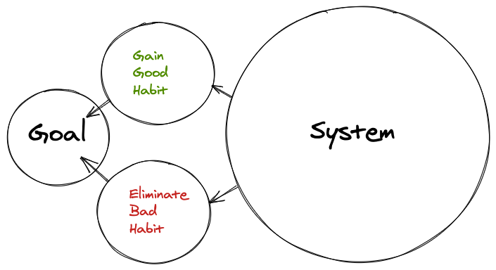
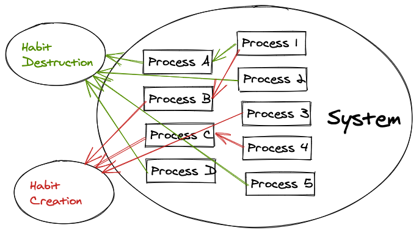

It is common knowledge that the best way to achieve what we want in life - become successful, get in shape, build a business, be happy; is to set specific goals. Some goals could be:

- Lose 20 lbs
- Play less video games

Which are fine to set, however most people will just leave it at that; and just focus on those 2 end results. Some people may set a strict diet, exercise daily, sell their video game console. While these solutions may work, they tend to not be sustainable. One may be able to keep it up for a month, or even the whole year; but end up back into their old habit very easily. Think about it; if I just focussed on a single result, and not the system that lead up to that result - do you think it would be sustainable?

> "The purpose of setting goals is to win the game. The purpose of building systems is to continue playing the game. Imagine you have a messy room and you set a goal to clean it. If you summon the energy to tidy up, then you will have a clean room—for now. But if you maintain the same sloppy, pack-rat habits that led to a messy room in the first place, soon you’ll be looking at a new pile of clutter and hoping for another burst of motivation. You’re left chasing the same outcome because you never changed the system behind it. You treated a symptom without addressing the cause."

- James Clear

## Address The Cause

The first step is to stop thinking of the goal! Break it down into 2 types of habits that result to the goal. It can be to gain a good habit or to remove a bad habit that each lead to said goal. For example instead of focussing on trying to lose 20lb, focus on what habit's will I need to gain to lose 20lb.

The next step is to realize in order to gain or lose the habit in question, you have to focus on the system that leads to these habits. Ask yourself:

- Why do I do this?
- Why don't I do this?

The beauty in viewing it this way is that the system used to create and remove a habit can be generalized to fit all types of habits. So once you figure out what works for you, the same process can be applied to different habits.

## You Still Need Goals

Goals are for setting a direction, and systems are for making progress in that direction.

> "If You Commit to Nothing, You'll Be Distracted By Everything"

- James Clear

## Inspirations

[https://jamesclear.com/goals-systems](https://jamesclear.com/goals-systems)
