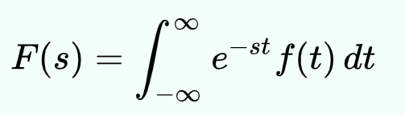
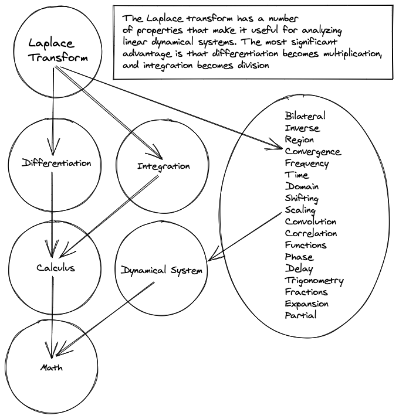

If there was one thing I regret most over the course of my studies; it wasn't:

- That I took so long
- That I failed courses
- That I didn't focus
- That I didn't spend my summers on internships

What I regret most; is that I didn't show my work. Maybe if I did that, I would've been a lot more ahead in life and wouldn't have all those regets that i listed.

> “The person who says he knows what he thinks but cannot express it usually does not know what he thinks.”  - Mortimer Adler

## The Feynman Technique

The idea is to understand the difference between knowing something and knowing the name of something. Relate it to the idea of goals and systems, it's about having a direction and then walking towards that direction. You need to figure out what you are trying to understand before beginning to understand it.

Richard Feynman created a formula for learning that allowed him to understand things very well. The formula is called The Feynman Technique.

### Step 1: Teach it to a child

The idea is to think of a way to articulate your knowledge on a complex topic in a way that a child would understand it. People tend to use complicated vocabulary to mask when they don't understand something. The problem is we fool ourselves; we hide behind these "names," thinking that we have a clear understanding when we don't.

This becomes very evident in STEM courses. Topics in math and physics such as the Laplace Transform or Lorentz Force Equation, become formula's that we memorize and not understand.

Teaching it to a child forces you to understand the concept at a deeper level. Since a child will not know about calculus, algebra, or physics; it will put you into a state of also needing to explain those topics. Which end up becoming core topics required to understand the concept. If you find yourself struggling at explaining a certain part, you have some gaps in knowledge and you'll have a better understanding of where those gaps are.

### Step 2: Review

Step 1 was to find the gaps, and now it's time to fill them.

### Step 3: Organize and simplify

We now have our notes on what we think we are lacking in, now it's time to organize and simplify them into a story. At this point we'll probably find some more topics that need explaining, we might need to go back a step (and this is okay, the technique is not a cookbook where you need to follow the steps in the right order).

It might help to be visual; topics that are building on each other can be viewed as a tree. Below is the general Laplace Transform formula and a visual with the topics needed to be understood.

### Step 4: Transmit

Now it's time to tell our story, and if you struggle again maybe you need focus on the core topics and work your way up the tree from there.

## You Don't Have To Teach A Child

What if it's not reasonable to always be running by your math course topics with a child?

### Teach your friends

You can help your friends while you help yourself!

### Teach your future self

Assume you are going to forget what you just learned in a year (you probably will). How could you structure your notes in a way that your future self will remember. I like to view knowledge as different nodes in the brain and that over time the connections between these nodes fade, especially when not frequently accessed (like unmaintained roads in Canada). Sometimes we just need some help making these connections again.

## Share Your Work

You might as well.

## Inspirations

[https://fs.blog/2015/01/richard-feynman-knowing-something/](https://fs.blog/2015/01/richard-feynman-knowing-something/)

[https://getpocket.com/explore/item/the-feynman-technique-the-best-way-to-learn-anything](https://getpocket.com/explore/item/the-feynman-technique-the-best-way-to-learn-anything)
