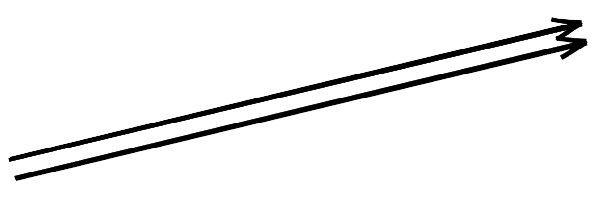

An innovator is a person who radically improves the design of something. Someone who builds on previous thoughts or ideas in a creative and forward thinking manner.

While a inventor is a person who comes up with something completely new. Someone who is basically a genius.

## Nothing is original

> "When people call something "original" there's a very high chance that they just don't know the references or the original sources involved. What a good artist understands is that nothing comes from nowhere. \_\_\_\_ people have walked this earth - do you really think it's possible to be original? All creative work builds on what came before." - Austin Kleon

> "There is nothing new under the sun." - Ecclesiastes 1:9

> "Everything that needs to be said has already been said. But, since no one was listening, everything must be said again." - Andre Gide

> "What is originality? Undetected plagiarism." - William Ralph Inge

## Think like an innovator

When we're free of the burden of trying to be completely original, we stop trying to make something out of nothing and by doing so we can embrace influence instead of running away from it.

Draw 2 lines, how many lines are there?

There's 2 black lines and then 1 white line in between.

1 + 1 = 3

1 idea + 1 idea = 3 ideas
