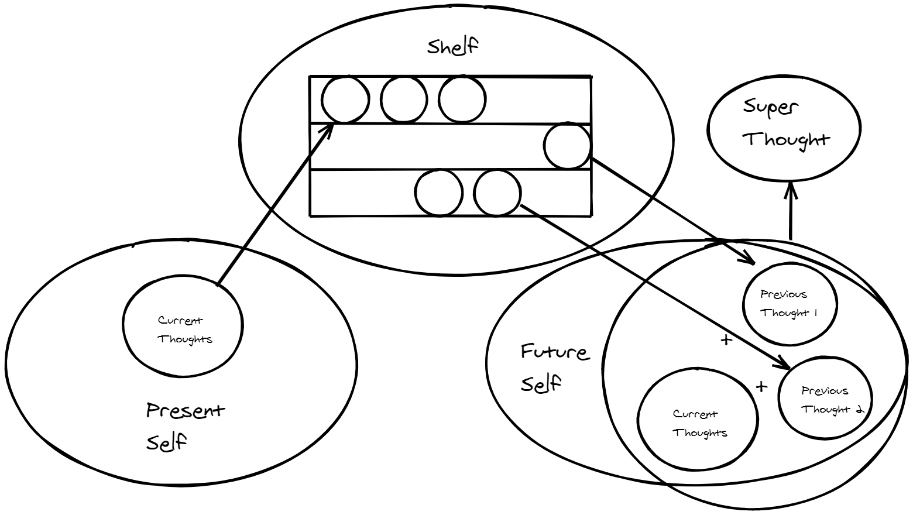
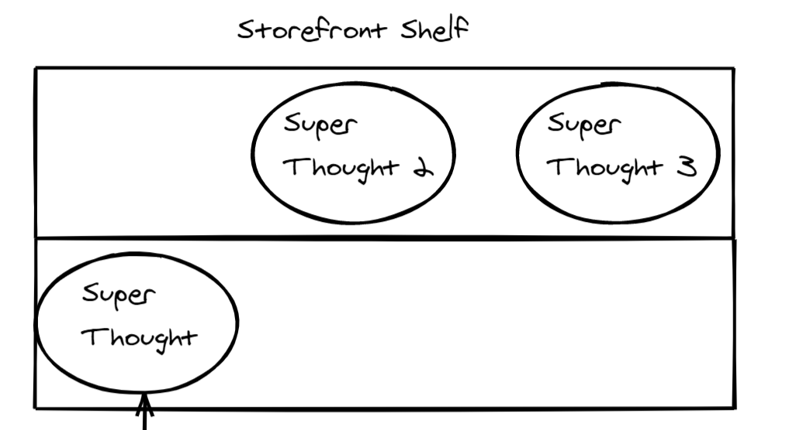

There's a theory that when people give you advice, they're really just talking to themselves in the past. What I write can be an example of me talking to a previous version of myself. If there's also a theory that the best way to understand something is to teach it. Then if I write to my future self with the intention of teaching my future self, I not only further increase my current understanding but also my future understanding?

## Write to your future self

Assume that all of your thoughts have a shelf life, it could be a week, month, year; doesn't matter. The point is at some point you will forget about it. So how could we put ourselves in a position where we'd be able to consume those thoughts at a later date, and maybe even conjure something even greater out of it?

How could we structure life in a way that our future selves will remember? I like to view knowledge as different nodes in the brain and that over time the connections between these nodes fade, especially when not frequently accessed; making it difficult to access them again. Sometimes we just need some help making these connections again, and with a proper system in place it won't take long.

A way to look at it, is a shelf; an infinitely large shelf. Where the shelf itself is its own system and if unkept, things will get lost in there.

## Organize your thoughts

First we have to come up with a system to organize our thoughts so that they can easily be accessed later on. It can be in a notebook, a word document, or an application. Just remember, this is a system → always look for ways to improve it; just because you find something that works, doesn't mean improvement ends there.

For me, my shelf is inside of an application called Notion.

[https://www.notion.so/](https://www.notion.so/)

## Show your work

Next we have to figure out a way to refine our thoughts, I like to call these "Super Thoughts" which are thoughts that build upon other thoughts. These special thoughts can be part of a special "Storefront Shelf." I think these thoughts are worth sharing.

However you can write it completely privately, with the intention that the only person that is going to read it, is your future self. Having at least that expectation that someone's going to read it adds an extra sense of accountability.
